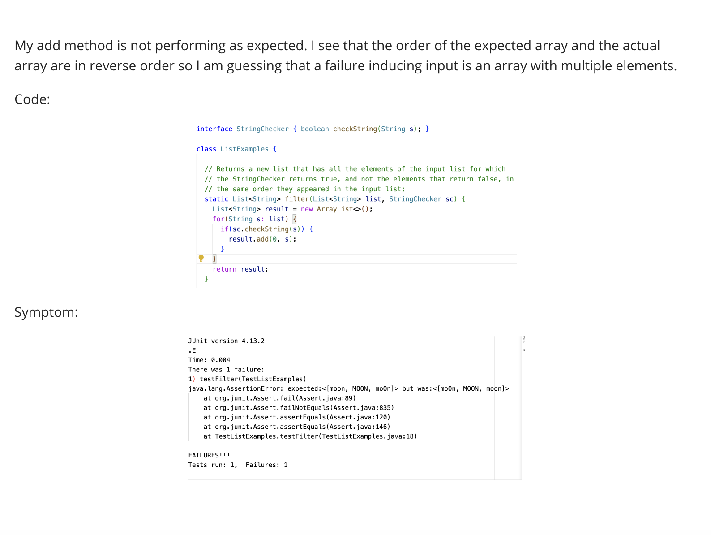
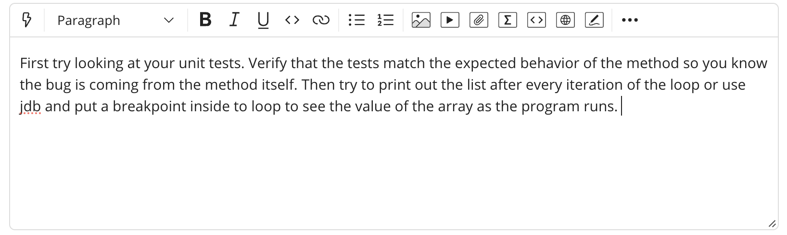
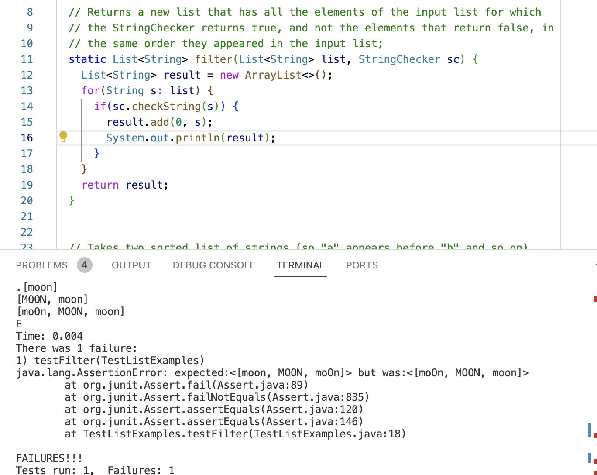
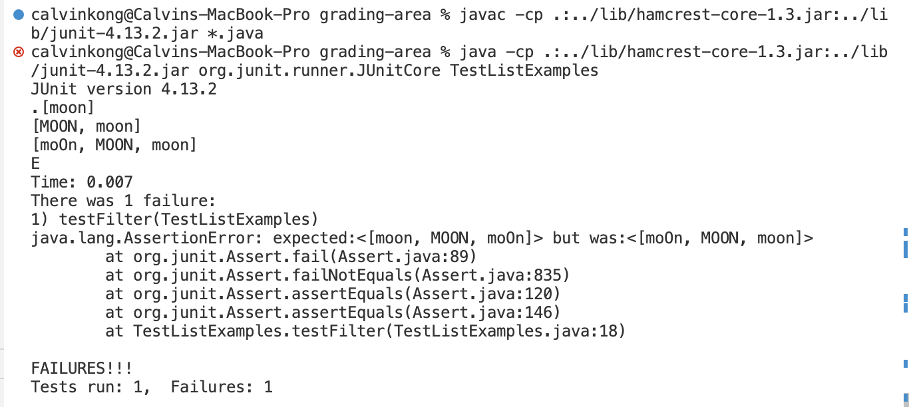

# Part 1 - Debugging Scenario

## 1
Edstem post: 



## 2
TA response:


## 3
Output from adding a print statement:



After printing the contents of result in the body of the loop, I can see that every element that passes the if condition is added to the front of the array. The new list needs to maintain the order of the origninal list so the bug is that we add s in the position of the array. 

## 4

File and directory structure

ListExamplesGrader/
  - TestListExamples.java
  - ListExamples.java
  - grade.sh

### Before fixing the bug
TestListExamples.java
```
import static org.junit.Assert.*;
import org.junit.*;
import java.util.Arrays;
import java.util.List;

class IsMoon implements StringChecker {
  public boolean checkString(String s) {
    return s.equalsIgnoreCase("moon");
  }
}
public class TestListExamples {

  @Test
  public void testFilter(){
    List<String> argList = Arrays.asList("moon", "moon1", "MOON", "moOn");
    List<String> expected = Arrays.asList("moon", "MOON", "moOn");
    StringChecker sc = new IsMoon();
    assertEquals(expected, ListExamples.filter(argList,sc));

  }
```
ListExamples.java
```
import java.util.ArrayList;
import java.util.List;

interface StringChecker { boolean checkString(String s); }

class ListExamples {

  // Returns a new list that has all the elements of the input list for which
  // the StringChecker returns true, and not the elements that return false, in
  // the same order they appeared in the input list;
  static List<String> filter(List<String> list, StringChecker sc) {
    List<String> result = new ArrayList<>();
    for(String s: list) {
      if(sc.checkString(s)) {
        result.add(0, s);
        System.out.println(result);
      }
    }
    return result;
  }
}
```
grade.sh
```
CPATH='.:../lib/hamcrest-core-1.3.jar:../lib/junit-4.13.2.jar'
javac -cp $CPATH *.java
java -cp "$CPATH" org.junit.runner.JUnitCore TestListExamples
```
Ran these commands to fix the trigger the bug and included the print statement for debugging purposes.


Could have also typed ```bash grade.sh``` instead

Because I we know that every element that passes the if condition is added to the front array which is the reverse order, we know that we need to add every element to the end of the array to maintain the order so ```result.add(0, s) ``` should be changed to ```result.add(s)``` so that every new element is added to the end of the array. The print statement can also be removed.

This is the updated ListExamples.java file which has the correct expected behavior
```
import java.util.ArrayList;
import java.util.List;

interface StringChecker { boolean checkString(String s); }

class ListExamples {

  // Returns a new list that has all the elements of the input list for which
  // the StringChecker returns true, and not the elements that return false, in
  // the same order they appeared in the input list;
  static List<String> filter(List<String> list, StringChecker sc) {
    List<String> result = new ArrayList<>();
    for(String s: list) {
      if(sc.checkString(s)) {
        result.add(s);
      }
    }
    return result;
  }
}
```

# Part 2 - Reflection

A tutor showed me the various features students have access to through the Github student devlopement pack. This introduced a whole new set of intresting resources which I could use to learn more, code more effeciently, and improve program quality. 
